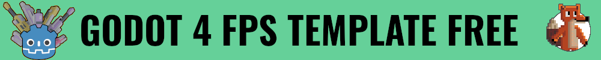
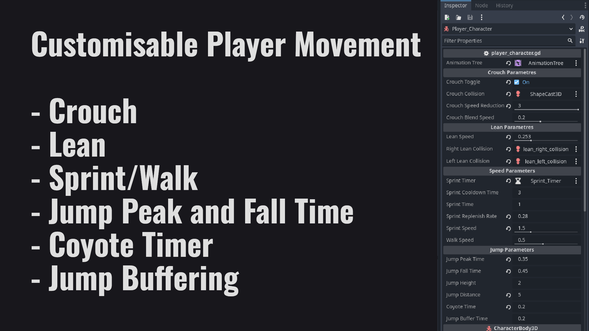

### This is an FPS Template for Godot 4.

The weapons are created via a resource called `Weapon_Resource` that allows you to add all the animations and stats to the weapon. The weapon manager will then load all the resources and use the small state machine to control which weapon is active.

The purpose of this template is to make prototyping a First Person Shooter a lot faster since the gameplay and weapons can be designed and art added later. This is because each weapon takes string references to each animation, and so you could design a large array of weapons with place holder animations, and then when the Rig is ready, swap it in and replace the animation references.

The template utilize components very heavily. The weapons themselves are components added to the state machine. The projectiles, whether hit scan or projectile are a separate component that are added to each weapon. And the spray profiles for each weapon. All can be swapped and changed without affecting the other elements.

  [itch.io](https://chafmere.itch.io/godot-4-fps-controller)

Need help understanding?

Check out the [Documentation](https://docs.chaffgames.com/docs/fpstemplate/table_of_contents/)

Here are some of the main features:

- Resource Based: [docs](https://docs.chaffgames.com/docs/fpstemplate/creating_a_new_weapon/#create-a-resource)
 

- State Machine to manage current weapon: [source](Player_Controller/scripts/Weapon_State_Machine/Weapon_State_Machine.gd)
 

- Movement Options - including lean:

- Preset Weapon Types, currently four weapons:

