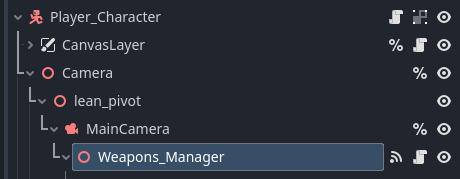
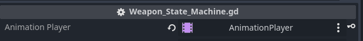
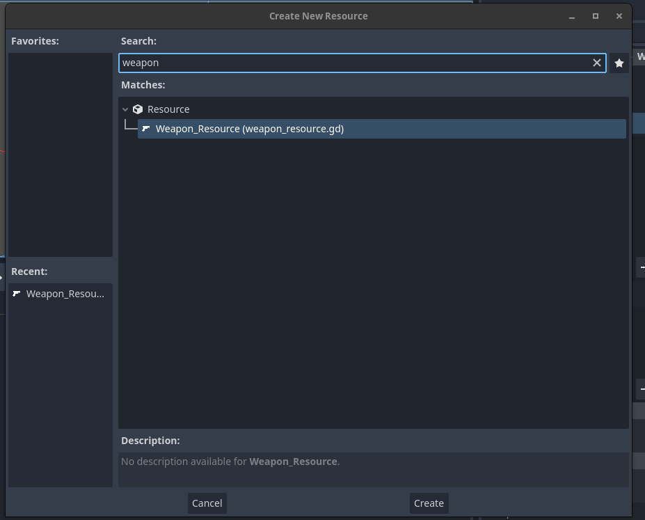
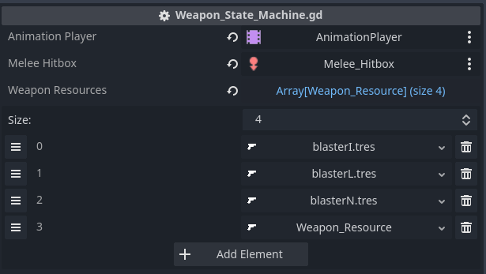
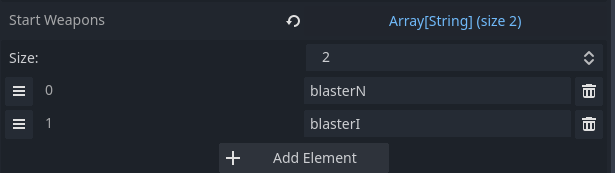
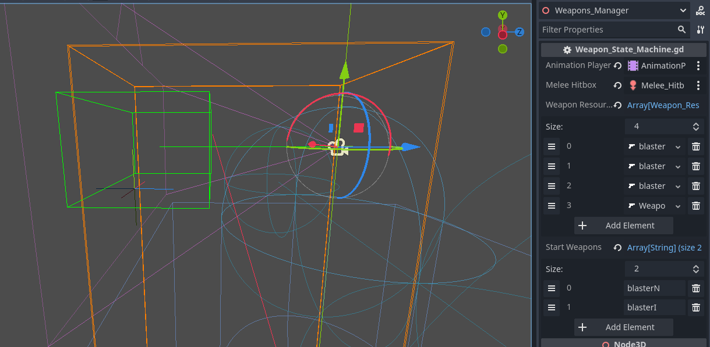

### How to Create a Weapon

The weapons are all controlled by the node Weapon Manager. It is a child of Main Camera.

First, create the animation in Blender or in Godot itself. *The FPS Template cannot create animations*. It comes shipped with some basic example animations.

All animations should be in a single Animation Player and added to the export variable Animation_Player.

Once you have your animations, the next thing you need to add is a Weapon Resource. These control all the data for your weapon.

You can right-click a folder, click "create new" > resource. You can then choose type "weapon resource" in the search box to create a weapon resource.

To create a weapon resource, there are 3 main fields:

1. **Weapon Name**: The reference for the active weapons and pickups.
2. **Weapon Animations**: You can add the string references for the animations you have created. **These are Strings!** So make sure that they are identical to the animations you want to play.
   - **Pick_Up_Anim**: The animation to play when the weapon was picked up.
   - **Shoot_Anim**: The animation to play when the weapon is shot.
   - **Reload_Anim**: The animation to play when the weapon reloads.
   - **Change_Anim**: The animation to play when the weapon is changed.
   - **Drop_Anim**: The animation to play when the weapon is dropped.
   - **Out_Of_Ammo_Anim**: The animation to play when the weapon is out of ammo.
   - **Melee_Anim**: The animation to play when you do the melee strike.

3. **Weapon Stats**: These are the basic numbers for your weapon.
   - **Current Ammo**: The current ammo of the weapon. Only needs a value if it is a starting weapon. This value is overridden on pickup.
   - **Reserve Ammo**: The amount in reserve. Only needs a value if it is a starting weapon. This value is overridden on pickup.
   - **Magazine**: The maximum amount that you will reload if ammo is zero.
   - **Max Ammo**: The maximum ammo that can be held in reserve.
   - **Damage**: The damage that a weapon will do.
   - **Melee Damage**: The melee damage that a weapon will do.
   - **AutoFire**: If Auto Fire is set to true, the weapon will continuously fire until the fire trigger is released.
   - **Fire Range**: The range that a weapon will fire. Beyond this number, no hit will trigger. In the case of a projectile weapon, if no hit is detected, the projectile will be sent to this point.

4. **Weapon Behaviour**: These are the components you can add to control the behaviour of the weapon. See individual Docs for detailed explanations.
   - **Can_Be_Dropped**: If checked, the weapon drop scene MUST be provided.
   - **Weapon_Drop**: The rigid body to spawn for the weapon. It should be a rigid body of type Weapon_Pick_Up and have a matching Weapon_Name.
   - **Weapon_Spray**: The Spray_Profile to use when firing the weapon. It should be of Type Spray_Profile. This handles the spray calculations and passes back the information to the Projectile to load.
   - **Projectile_To_Load**: The Projectile that will be loaded. Not a rigid body but a class that handles the ray-cast processing and can be either hitscan or rigid body. Should be of Type Projectile.
   - **Incremental_Reload**: Incremental Reload is for shotgun or single item loaded weapons where you can interrupt the reload process. If true, the Calculate_Reload function on the weapon_state_machine must be called independently. For example, at each step of a shotgun reload, the function is called via the animation player.

Once all of this has been added, you can add the weapon resource to the weapon resource array on the weapon manager node.

This array should be a list of **all weapons that the player can possibly pick up, not what they have in possession**. So it should contain a complete list of weapons in your game.

In order for these weapons to be made available to your player, they either must be picked up via a weapon pickup or be added to the start weapons array.

The Start Weapons array is a list of weapons that the player will be given at spawn. You can fill it here or at runtime via a singleton (no such singleton is provided) if loading a save or moving between levels and want to keep the weapons. These are only string references so no Ammo data will be kept, a feature to be added at a later date.

Finally, there is a shape cast 3D node for the hitbox. This can either be animated to fit the weapon, replaced, or just kept as is (currently a very generous hitbox). When the melee strike is performed, it will target the object in the collider for a melee strike.

