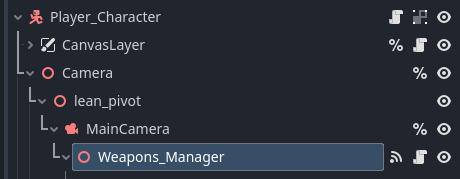
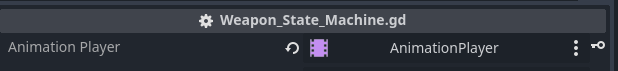
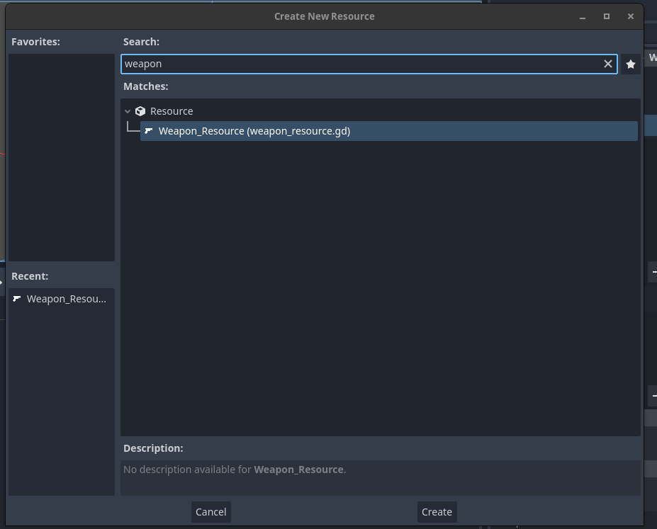
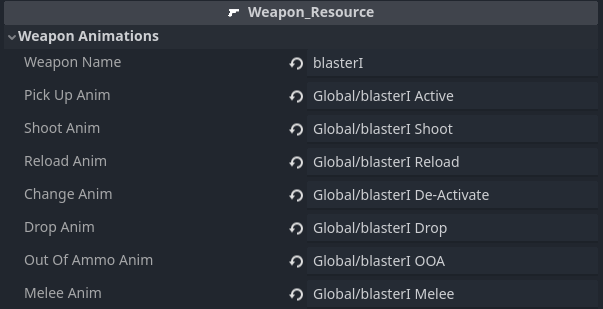
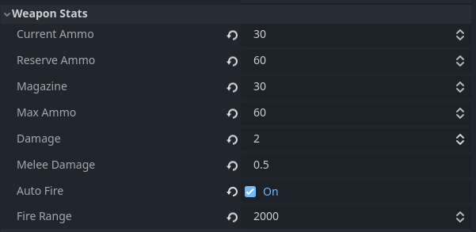
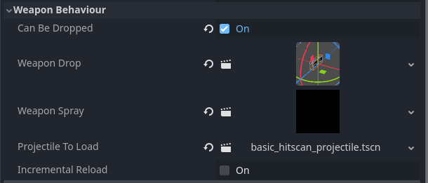
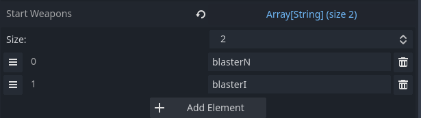
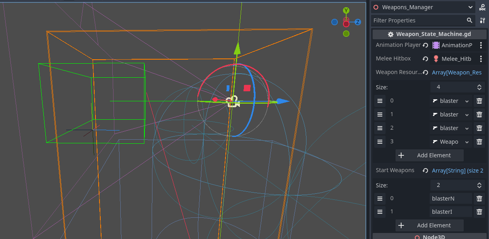

### How to Create a weapon

The weapons are all controled by the node Weapon Manager. It is a child of Main Camera.

First Create the animation in Blender or in Godot itself. *The FPS Template cannot create animations*. It comes shipped with some basic example animations.

All Animations should be in a single Animation Player and added to the export variable Animation_Player

Once you have your animations the next thing you need to add is a Weapon Resources. These control all the data for your weapon.

You can right click a folder click "create new" > resource. You can then choose type "weapon resource" in the search box to create a weapon resource.

To Create a weapon resource there are 3 main fields:

1. Weapon Name. The Reference for the active weapons and pick ups.
2. Weapon Animations. You can add the string references for the  Animations you have created **These are Strings!** So make sure that they are identical to the animations you want to play.

   * Pick_Up_Anim
     * The Animation to play when the weapon was picked up
   * Shoot_Anim
     * The Animation to play when the weapon is shot
   * Reload_Anim
     * The Animation to play when the weapon reloads
   * Change_Anim
     * The Animation to play when the weapon is Changed
   * Drop_Anim
     * The Animation to play when the weapon is dropped
   * Out_Of_Ammo_Anim
     * The Animation to play when the weapon is out of ammo
   * Melee_Anim
     * The Animation to play when you do the melee strike

3.  Weapon Stats. These are the basic numbers for your weapon.

   * Current Ammo.
     * The Current Ammo of the weapon. Only needs a value if is a starting weapon. Otherwise is set on pick up.
   * Reserve_Ammo
     * The Amount in Reserve. Only needs a value if is a starting weapon. Otherwise is set on pick up.
   * Magazine
     * The Maximum amount that you will reload if zero
   * Max_Ammo
     * The Maximum ammo that can be held in reserve.
   * Damage
     * The Damage that a weapon will do
   * Melee_Damage
     * The Melee Damage that a weapon will do.
   * AutoFire
     * If Auto Fire is set to true the weapon will continuously fire until fire trigger is released
   * Fire_Range
     * The Range that a weapon will fire. Beyong this number no hit will trigger.

4. Weapon Behaviour. These are the componets you can add to control the behaviour of the weapon. See indiviual Docs for detailed explanations.

    * Can_Be_Dropped
        * If Checked the weapon drop scene MUST be provided
    * Weapon_Drop
        * The Rigid body to spawn for the weapon. It should be a Rigid Body of type Weapon_Pick_Up and have a matching Weapon_Name.
    * Weapon_Spray
        * The Spray_Profile to use when firing the weapon. It should be of Type Spray_Profile. This handles the spray calculations and passes back the information to the Projectile to load
    * Projectile_To_Load
        * The Projectile that will be loaded. Not a Rigid body but class that handles the ray cast processing and can be either hitscan or rigid body. Should be of Type Projectile
    * Incremental_Reload
        * Incremental Reload is for shotgun or sigle item loaded weapons where you can interupt the reload process. If true the Calculate_Reload function on the weapon_state_machine must be called indepently. For Example: at each step of a shotgun reload the function is called via the animation player.

Once all of this has been added then you can the weapon resource to the weapon resource array on the weapon manger node. 
This array should be a list of **all Weapons that the player can possibly pick up Not what they have in possesion**. So it should contain a complete list of weapons in your game.

In order for these weapons to be made available to your player they either must be picked up via a weapon pick up or be added to the start weapons array.

The Start Weapons array is a list of weapons that the player will be given at spawn. You can fill it here or at run time via a singleton (no such singleton is provided.) if loading a save or moving between levels and want to keep the weapons. These are only string references so no Ammo data will be kept, a feature to be added at a later date.

Finally there is a shape cast 3d node for the hit box. This can either be animated to fit the weapon, replaced or just kept as is (current a very generous hitbox). When the melee strike is perfomed it will target the object in the collider for a melee strike.