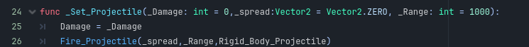
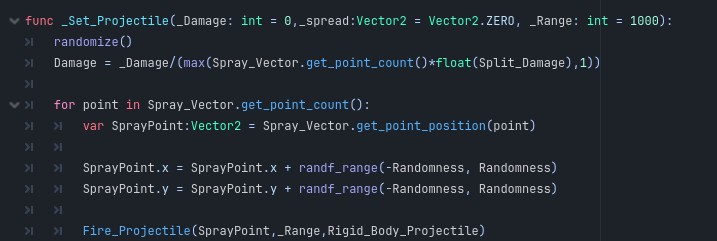

A Projectile to load is not a physical projectile.

It can be a rigid body if you want it to be. But what it actually is, is an object that is loaded when you press the fire button and is responsible for ray casting and detecting a hit. It can be either a hit scan weapon or it can be a "rigid body projectile".

A Projectile_To_Load should be placed on every weapon resource that exists in your game. It is a required object for the manager to function.

Let's look at the flow of the code to understand a bit better how the projectiles are designed to work.

The first few lines are all focused on checking what the player is doing, like reloading or already firing. The next thing it does is play the animation, reduce ammo, and update the HUD.

After that, it will calculate the spread [via the spray profile](Spray_Profile.md) and the very last thing it does is call the Load Projectile function.

In essence, the shoot function within the manager does not do any damage checking, firing, or ray casting. All it does is check if you can shoot, and if you can, play an animation and ask for a spray value before handing off to the projectile.

The Weapon Manager then instantiates the Projectile and calls the function Set_Projectile passing in the damage, spread, and range.

Okay, so now let's look at the Projectile To Load itself.

The Projectile Class is an object that can ray cast and determine if the object it hit can be damaged.

There are a few options available to us when setting up.

- Projectile Type
  - Can be either a Hit Scan or Rigid Body Projectile. If Rigid body is selected, a Rigid Body must be provided.
- Display Debug Decal
  - Will spawn a red dot on the point where the bullet hit. This is good for early stages when regular decals have not been set up yet.
- Projectile Velocity
  - The speed at which a rigid body is sent from the weapon.
- Expiry Time
  - The amount of time before the rigid body will despawn if it has not hit anything.
- Rigid Body Projectile
  - The Rigid Body to spawn if the projectile is a rigid body projectile.

There is not a lot to set up here. If a simple Hitscan weapon is needed, a projectile object saved in a scene with nothing else and added to a weapon manager *should* just work.

The main reason for the component is to give the user the ability to inherit from this class and override the _Set_Projectile function to create other kinds of weapons. For example, a shotgun that does 12 ray casts at once.

The Set Projectile Function sets the damage to its own internal variable and then calls Fire_Projectile which takes care of the ray cast detection.

To make a shotgun, you can override this function and call 9-12 ray casts for every "Pellet" you fire.

Of course, when doing this, don't change the number of parameters taken by the function. Otherwise, Godot will throw an error. For example, the Spread sent to us is not really needed since the shotgun is going to create its own pattern.
