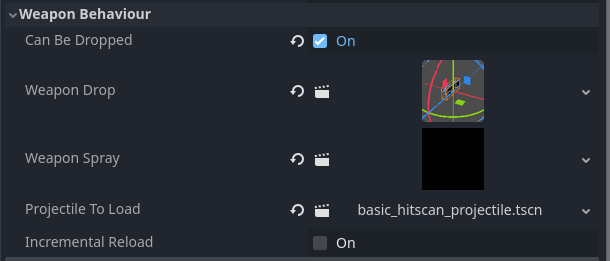
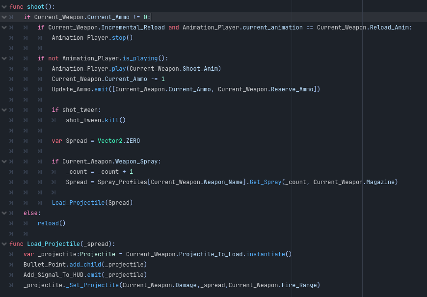
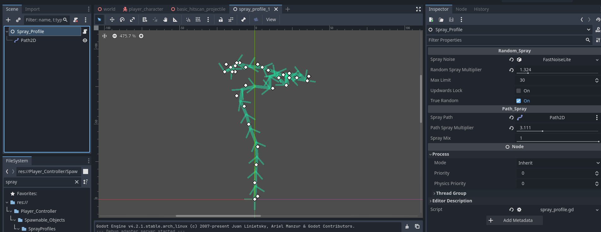
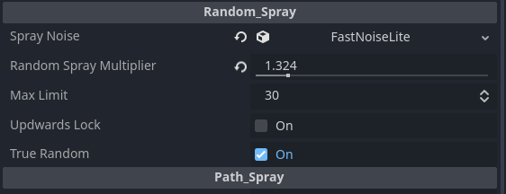
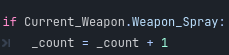
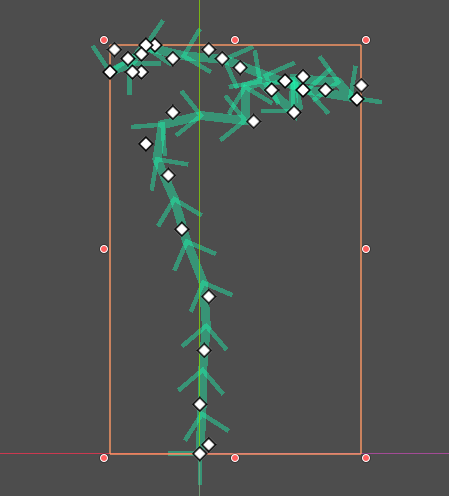

[Back to Table of Contents](Table_Of_Contents.md)

# **Spray Profiles**

To add a spray profile to your weapon, you can add it under weapon behavior.

Let's quickly go over how shooting works in the FPS template.

When you fire a weapon, the first thing it does is play the animation, reduce the ammo count, and notify the HUD that ammo has been used.

The next thing we do is load a projectile. A projectile is an object that does the raycasting for the weapon. It takes a variable called Spread. This spread gets added to the endpoint of the raycast projection, like drawing a line up the screen. We can project the point from here to collide with whatever is in between.

Unlike a projectile, a spray profile is not a requirement for the weapon manager. It will check that one exists before calling it. Some people only want the movement of the camera to affect the aiming. So you can just leave these off the weapon manager. A cool idea would be to hook this spray profile into the camera instead of the raycast if you wanted that.

To create a spray profile, you can create a new scene and search for the spray profile class.

Spray Profiles support both random spray and pathed spray (like CSGO and Valorant).

****

### **RANDOM SPRAY**

 **Random_Spray**: Options for the Random elements of the spray.
   - **Spray_Noise**: FastNoiseLite that can be added to generate random spread.
   - **Random_Spray_Multiplier**: Default 1.0. The amount of random spread. Could be used to increase spread when moving.
   - **Max_Limit**: Default 30.0. The maximum that the shot count can go.
   - **Upwards_Lock**: Forces the animation to be always up.
   - **True_Random**: Changes the seed of the noise before every shot.

To add random spray, create a fast noise lite to the spray noise variable. Increase the Random Spray multiplier to more than zero.

To set a limit on the amount of spread input a max limit. To understand what the max limit is, we first need to talk about "heat" or in the FPS Template "Shot Count".

In most FPS games, the more you fire the weapon, the greater the spread or spray of your weapon. If you release the fire button, the "Heat" will slowly reduce. The FPS Template has the exact same functionality found in the variable "Shot Count". Every time you fire, the shot count is increased by 1, up to the max limit or the number of bullets in the weapon's magazine. Why Shot count and not heat? In the code, this behavior is literally the number of shots you've fired. No sense beating around the bush about it.

Then we have two other variables called upwards lock, which forces the random spray to always be up.

And true random *(still not truly random)*, which will change the seed every shot. Otherwise, the random spread would only be randomly generated.

****

### **Path Spray**

**Path_Spray**: Options for the elements of the Path Spray.
   - **Spray_Path**: Path2D that can be added to generate a path for the bullets to follow.
   - **Path_Spray_Multiplier**: float. Default 1.0. range 0.0 to 10.0. Default 1.0. the power of the path spray.
   - **Spray_Mix**: float. Range 0.0 to 1.0. Default 1.0. The mix between random and path spray. 0 for no random and 1 for both. To remove path, do not add a Path2D to the scene or reduce the Path_Spray_Multiplier to zero.

To create a pathed spray, you need to add a Path2D to the scene. With a Path2D, we can draw a path for our bullets to follow. Every point on the path represents a point at which the bullet will hit. So be sure to add enough points for your bullets to follow.

If fewer points than bullets, the spray profile will just use the last point in the Path2D.

A reasonable amount for spray is really up to the designer, but somewhere between 50-100 pixels is more than enough. This will depend on other factors like screen size and resolution, of course.

If screen shake is added, then even less may be desired.

You can control the amount with the variable Path_Spray_Multiplier. This can also be hooked to movement to increase spray.

Finally, we have the spray mix, which can influence the amount of path spray vs random. If a mix of both is desired, then a value over 0 is fine. 0 being no random and 1 being both random and path spray.

If you do not want path spray, don't add a Path2D to the scene.

