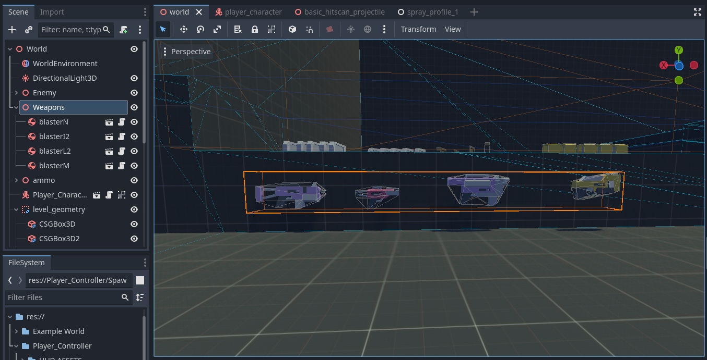
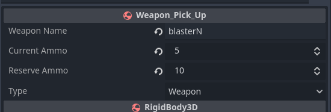
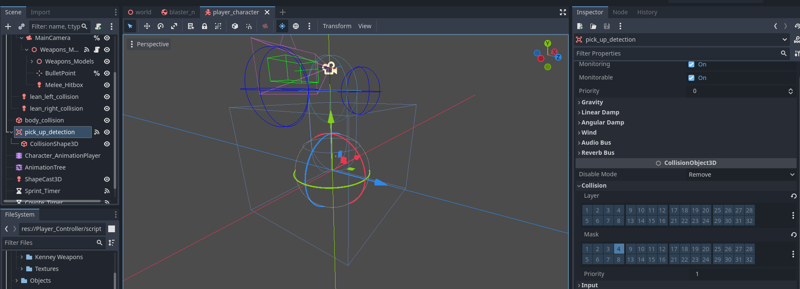

[Back to Table of Contents](Table_Of_Contents.md)

# Weapon Pick Ups and Drops

### **Weapon Pick Up**

**Weapon_Pick_Up**: Options for the rigid body to be picked up as a weapon
   - **_weapon_name**: String. Must match the weapon name in the Weapon Resource.
   - **_current_ammo**: int. The amount of ammo that the weapon has available to be shot right away. Will override Weapon_Resource.Current_Ammo on pick up.
   - **_reserve_ammo**: int. The amount of ammo that the weapon will have in reserve. Will override Weapon_Resource.Reserve_Ammo on pick up.
   - **TYPE**:  String Enum. Weapon or Ammo. Set as Weapon to pick up a weapon. Set as ammo to create an ammo pick up.

The ability to pick up and drop weapons is a core feature of most FPS games.

There are a few options that we have within the template to tweak the functionality to our liking.

In order to be able to pick up or drop weapons, a rigid body must be created that can be spawned into the world, representing the weapon that can be picked up when in contact with the player.

Within the template exists a class called Weapon_Pick_Up, which extends RigidBody3D. This is a small class to help with creating weapon pick ups but is not core to the game template itself. There is no type check on the pick-up detector currently.

Add this to a scene to start creating a weapon pick up. There are 4 Variables to edit.

The Weapon Name *MUST* match the name of the weapon resource. Think of it like a key for a table lookup. When you cross over a weapon pick up, the name will be passed into the manager and will check against available weapons. If a match is found, it is added to the Array of available weapons (WeaponStack) and set as the current weapon.

The Current Ammo is the amount that will be available to shoot without reloading. It overrides whatever value that Weapon_Resource.Current_Ammo is for that weapon.

The reserve ammo will be available on reload. It overrides whatever value that Weapon_Resource.Reserve_Ammo is for that weapon. The reserve ammo is not kept on hand when the weapon is dropped. Every game handles this a little differently. What I have settled on is a more COD/Halo style. The ammo stays with the weapon. And you cannot pick up ammo for weapons you do not have in your possession. Feel free to change the behavior to suit your needs.

### How Does the player know to pick up weapons?

The Player character has an Area3d called Pick Up Detection that emits a signal to the weapon manager to notify it has detected a weapon is found.

All Weapon pick ups should be on layer 4 to be detected by this collider.

### Ammo

The same script can be used to pick up ammo as weapons. Simply set the enum TYPE To ammo. Make sure to change the model to some ammo clips as to not confuse the player.

It does not matter if the ammo is entered as current or reserve. The manager will take the sum of both values and assign them to any weapon that the player has in their inventory that matches the name key.

If the player walks over a weapon that they already have and aren't at max ammo yet, the ammo will be taken from the weapon pick up and assigned to the reserve ammo.

If the ammo or weapon pick up is left with zero ammo, it will be queue_freed from the game.
